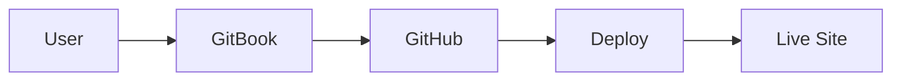

# Advanced Topics

Explore advanced features and use cases.

## 🚀 Overview

This guide covers advanced topics for power users and developers.

## 🔧 Advanced Configuration

### Custom Domain

Set up a custom domain for your GitBook site:

1. Go to Space Settings
2. Navigate to "Domain"
3. Add your custom domain
4. Configure DNS records:

```
Type: CNAME
Name: docs
Value: hosting.gitbook.io
```

### Git Sync Configuration

Advanced Git sync options in `.gitbook.yaml`:

```yaml
root: ./

structure:
  readme: README.md
  summary: SUMMARY.md

redirects:
  previous: ./docs/

# Advanced options
pdf:
  download: true
  toc: true
  
# Ignore patterns
ignore:
  - node_modules/
  - .git/
  - _drafts/
```

## 🌍 Multi-language Support

### Setting Up i18n

Create language-specific directories:

```
test-gitbook-doc/
├── README.md          # Default (English)
├── SUMMARY.md
├── en/               # English (explicit)
│   ├── README.md
│   └── SUMMARY.md
└── zh/               # Chinese
    ├── README.md
    └── SUMMARY.md
```

### GitBook Configuration

```yaml
root: ./

languages:
  - name: English
    code: en
    path: ./en/
  - name: 简体中文
    code: zh
    path: ./zh/
```

## 🤖 AI Integration

### AI Search Features

GitBook AI provides:

- **Semantic Search**: Understands context, not just keywords
- **Question Answering**: Ask questions in natural language
- **Suggested Content**: AI recommends related articles

### Enabling AI

1. Requires GitBook Plus or Pro plan
2. Go to Space Settings → AI
3. Enable "GitBook AI"
4. Configure AI behavior

### AI Query Examples

```
User: "How do I install?"
AI: Shows installation.md and relevant steps

User: "What's the difference between X and Y?"
AI: Compares and explains differences

User: "troubleshooting connection issues"
AI: Finds troubleshooting sections
```

## 📊 Analytics and Tracking

### Google Analytics

Add to `.gitbook.yaml`:

```yaml
integrations:
  googleAnalytics:
    id: G-XXXXXXXXXX
```

### Custom Tracking

Embed custom scripts for advanced tracking:

```html
<script>
  // Your custom tracking code
  analytics.track('page_view', {
    page: window.location.pathname
  });
</script>
```

## 🔐 Access Control

### Public vs Private

**Public Documentation:**
- Free tier available
- Visible to everyone
- SEO indexed

**Private Documentation:**
- Requires paid plan
- Access control by email/domain
- Not indexed by search engines

### Team Permissions

Set up team access:

1. **Admin**: Full control
2. **Editor**: Can edit content
3. **Viewer**: Read-only access

## 🎨 Custom Branding

### Theme Customization

Customize your GitBook appearance:

- **Logo**: Upload custom logo
- **Colors**: Brand colors and theme
- **Favicon**: Custom favicon
- **Font**: Custom typography

### Custom CSS (Enterprise)

```css
/* Custom styles */
.page-header {
  background: linear-gradient(135deg, #667eea 0%, #764ba2 100%);
}

.content {
  font-family: 'Your Custom Font', sans-serif;
}
```

## 🔗 API Integration

### Embedding Content

Embed external content:

```markdown

Video title



CodePen demo

```

### OpenAPI Integration

Import OpenAPI/Swagger specs:

```yaml
# In .gitbook.yaml
openapi:
  - ./api-specs/openapi.yaml
```

## 🔄 Advanced Git Workflows

### Branching Strategy

```bash
# Create feature branch
git checkout -b docs/new-feature

# Make changes
git add .
git commit -m "docs: add new feature documentation"

# Push to GitHub
git push origin docs/new-feature

# Create PR on GitHub
# GitBook can preview from specific branches
```

### GitBook Branch Previews

1. Enable branch previews in settings
2. Each PR gets a preview URL
3. Review changes before merging

## 📦 Content Reuse

### Using Snippets

Create reusable content blocks:


**Tip**: This is a reusable snippet that can be included in multiple pages.


### Content References

Reference content from other pages:

```markdown

[installation.md](../getting-started/installation.md)

```

## 🧪 Testing and Quality

### Pre-publish Checklist

- [ ] All links work
- [ ] Code examples tested
- [ ] Images display correctly
- [ ] No typos or grammar errors
- [ ] Consistent formatting
- [ ] Mobile-friendly

### Automated Testing

```yaml
# GitHub Actions example
name: Docs Quality Check
on: [push, pull_request]

jobs:
  check:
    runs-on: ubuntu-latest
    steps:
      - uses: actions/checkout@v2
      - name: Check broken links
        run: npm run check-links
      - name: Spell check
        run: npm run spell-check
```

## 🚀 Performance Optimization

### Image Optimization

- Use appropriate formats (WebP for photos, SVG for logos)
- Compress images before uploading
- Use CDN for external images

### Content Optimization

- Keep pages focused and concise
- Use code blocks instead of screenshots for code
- Lazy load heavy content

## 🔍 SEO Best Practices

### Meta Tags

Optimize for search engines:

```markdown
---
description: Clear description for SEO
keywords: keyword1, keyword2, keyword3
---
```

### URL Structure

Use clean, descriptive URLs:

```
✅ Good: /guides/authentication
❌ Bad: /page-123
```

## 📈 Metrics and Insights

### Track Important Metrics

- Page views
- Search queries
- User engagement
- Popular content
- Drop-off points

### Using Insights

Use GitBook's built-in analytics to:
1. Identify popular content
2. Find gaps in documentation
3. Improve user experience
4. Optimize content strategy

## 🎓 Advanced Examples

### Complex Code Example

```typescript
interface ApiResponse<T> {
  data: T;
  status: number;
  message: string;
}

async function fetchData<T>(endpoint: string): Promise<ApiResponse<T>> {
  try {
    const response = await fetch(endpoint);
    const data = await response.json();
    
    return {
      data,
      status: response.status,
      message: 'Success'
    };
  } catch (error) {
    throw new Error(`API Error: ${error.message}`);
  }
}

// Usage
const result = await fetchData<User>('/api/users/1');
console.log(result.data);
```

### Mermaid Diagrams (if supported)



## 📚 Resources

- [GitBook Official Docs](https://docs.gitbook.com/)
- [GitHub Integration Guide](https://docs.gitbook.com/integrations/git-sync)
- [API Reference](../api/overview.md)

---

**Next:** [API Overview](../api/overview.md) →

